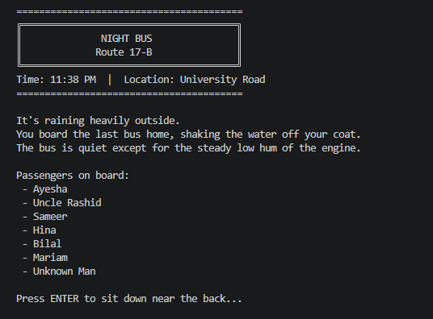

# Night Bus: Route 17-B

An atmospheric, text-based terminal horror and investigation game built in Python.

## Description

*Night Bus* is a narrative-driven terminal game that blends psychological horror, investigation, and multi-branching storytelling. Set aboard the last bus home at 11:38 PM during a heavy rainstorm, you play as a commuter expecting a quiet 40-minute ride alongside seven other passengers. However, as the route progresses, passengers vanish without a trace, seats shift, and the physical route strays far from its scheduled stops. Through careful observation, questioning suspects, and uncovering hidden contradictions, you must piece together the truth behind a tragic accident that occurred one year prior—and figure out why you are on this bus in the first place. Every decision reshapes the investigation, leading to six unique narrative endings.

### Screenshots


## Getting Started

### Dependencies

* **Operating System:** Windows 10/11, macOS, or Linux.
* **Python Version:** Python 3.6 or higher.
* **Libraries:** Standard built-in libraries only (`time`). No third-party modules or `pip` installations are required.

### Installing

1. Download or clone the project repository to your local machine:
```bash
git clone https://github.com/sakinazehrapk-maker/Night-bus

```


2. Navigate into the directory where the source file is located:
```bash
cd night-bus

```


3. Ensure the script file (e.g., `main.py`) is located in your desired directory. No modification of files or folder structures is required.

### Executing program

* Run the program directly from your command line or terminal.

1. Open your terminal, command prompt, or PowerShell.
2. Navigate to the folder containing `main.py`.
3. Run the script using Python:

```bash
python main.py

```

*(On some systems, you may need to use `python3 main.py` instead.)*

## Help

* **Terminal Display Formatting:** If the ASCII headers or borders look misaligned, maximize your terminal window or adjust the text size to ensure a minimum width of 80 characters.
* **Input Errors:** Ensure you type the numeric value corresponding to your choice (e.g., `1`, `2`, `3`) and press `Enter`.
* **Program Frozen:** The game uses brief timed delays (`time.sleep`) to build atmospheric tension during transition events. Wait a few seconds or press `Enter` when prompted.

To view basic command execution options:

```bash
python main.py --help

```

## License

This project is licensed under the MIT License - see the LICENSE.md file for details.